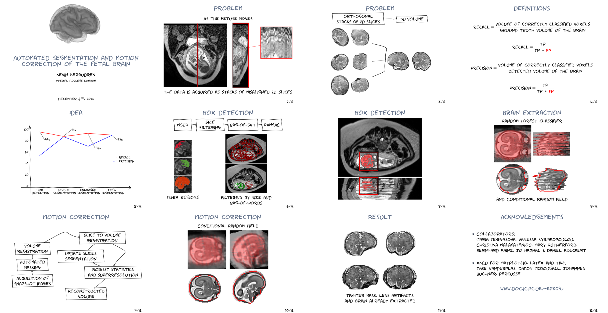

xkcd-beamer
===========

See http://kevin-keraudren.blogspot.co.uk/2014/03/xkcd-style-beamer-presentation-latex.html for more details.

    mkdir -p tmp_slides
    
    convert -density 400 presentation.pdf -resize 1024x768 -colorspace sRGB -type TrueColorMatte -depth 8 tmp_slides/slide.png
    
    montage tmp_slides/slide-{0..11}.png -tile 4x3 -geometry 562x384+2+2  montage.png

